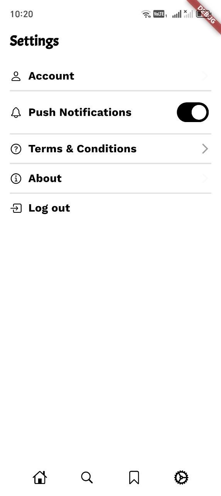

<h1 align="center">📰 News 24</h1>

<p align="center">
  A clean, minimal news reader built with Flutter — latest headlines by category, article details, bookmarks and sharing.
</p>

<p align="center">
  
  
  
  
  
</p>

---

## 📱 Screenshots

<p align="center">
  
  &nbsp;&nbsp;
  
</p>

<p align="center">
  <sub><b>News feed</b> &nbsp;•&nbsp; <b>Settings</b></sub>
</p>

## ✨ Features

- 🗞️ **Live news** from NewsAPI — top headlines and topic feeds
- 🏷️ **Category chips** — All, Tesla, Top, Apple
- 📄 **Article details** with author, source and publish time
- 🔗 **Share** articles with `share_plus`
- 💾 Local storage with `get_storage`
- 🌐 **No-internet & not-found screens** with connectivity checks
- ✨ Shimmer loading and Lottie animations
- ⚙️ Settings — account, change password, push notifications, terms, about

## 🛠️ Tech Stack

| Category | Packages |
|---|---|
| State management | `flutter_bloc`, `bloc` |
| Networking | `dio` (NewsAPI) |
| UI | `google_fonts`, `flutter_svg`, `shimmer`, `lottie` |
| Utilities | `connectivity_plus`, `share_plus`, `path_provider`, `get_storage` |

## 📁 Project Structure

```
lib/src/
├── core/              # Router, API service, colors, icons, shared widgets
└── features/
    ├── auth/          # Login, forgot password
    ├── home/          # Feed, categories, details (Cubit)
    ├── settings/      # Account, password, terms, about
    └── connection/    # No internet / not found
```

## 🚀 Getting Started

```bash
git clone https://github.com/azamat23012010-ui/news_app.git
cd news_app
flutter pub get
cp env.example.json env.json   # then put your key inside env.json
flutter run --dart-define-from-file=env.json
```

> 🔑 Get a free API key at [newsapi.org](https://newsapi.org). `env.json` is git-ignored, so your key never gets committed.

---

<p align="center">Made with 💙 by <a href="https://github.com/azamat23012010-ui">Azamat</a></p>
